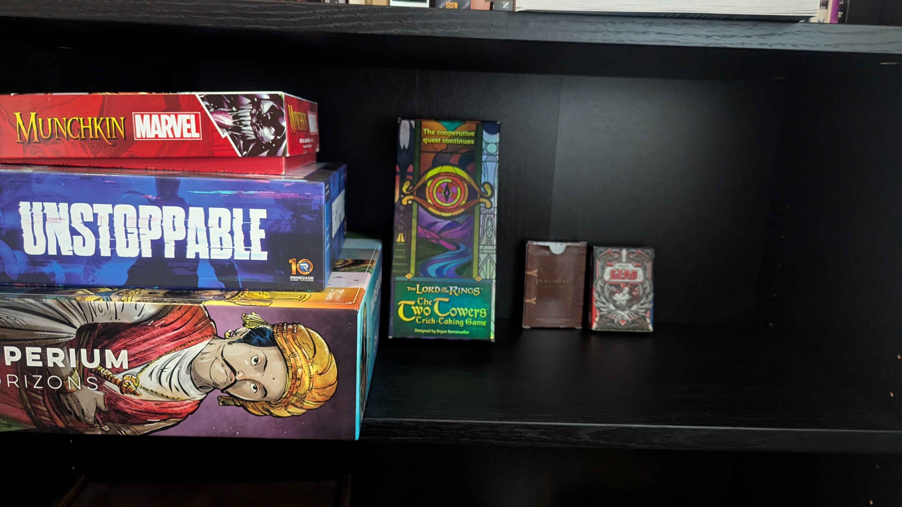

---

title: 'Board Game Collection (Feb 2026)'
pubDate: 2026-02-24
description: 'My '
author: 'Tal'
tags: ["Board Games", "Goddamn good time"]
---

My collection's slightly bigger!!! I am very happy with the games I currently have. In order of favourites the collections so far is

- Imperium Horizons
- The Lord of the Rings: The Two Towers Trick Taking Game
- Unstoppable
- Munckins: Marvel

At this point I have a solid collection! And not a lot of money spent on it!!! Woot woot. In terms of expanding on this I want to be very particular in the game department. Currently there is a deck builder, a trick taking game (you'll never guess which one that is), another deck builder, and a easy party game. So with that in mind, I tend to lean towards deck builder games. In terms of content these games offer, there is still so much to do in my top 3 games. So my next game will have to wait till I get through these more than I currently have. There's a want to spread out my game collection. Naturally most board games will have a card component, but I would love to have games that involve more worker placement or dice rolling. Just to give them a more distinct feeling from the rest of my games. 

I currently have my eyes on *Ultra Tiny Card Galaxies* and *One Deck Dungeon*. There is a strong focus on dice rolling and manipulating that in those games, on top of a buuunch of content to get through. Ideally I don't buy them for a while but I will be using this as a reference for when it's time to buy my next game.

