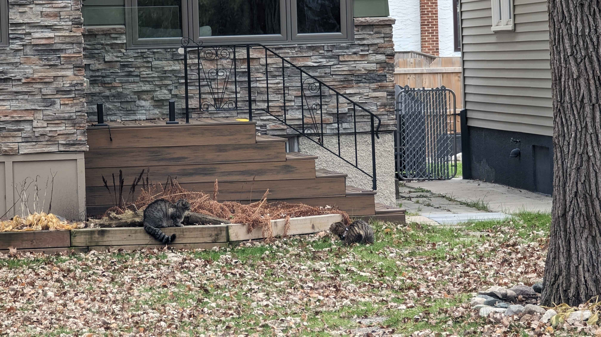

---

title: 'Weeknotes #1'
pubDate: 2025-11-08
description: 'Starting a new habit'
author: 'Tal'
tags: ["Weeknotes"]
---

#### Fun things this week 

- Managed to increase the amount of times I worked out this week! I did 4 sessions instead of 3, and I even started adding more exersices to my workouts 💪

- Walked around when I ran into these two cats. From a distance I thought the cat on the left (who I will be referring to as Racatoon from now on) was a racoon :0. The cat on the right kept on meowing to the cat on the left
(who I will be referring to as Meowsimus Prime from now on). Meowsimus had this adorable high pitched meow, and I do wonder what Racatoon did to Meowsimus to ellicit such a 
reaction. I hope the two are doing well.

- Got a haircut finally woot woot. Went back to a barber I haven't seen in a while and that was a pleasent experience. We're both huge movie heads so we just talked about that
for almost the entire time. He even offered me a free haircut for a social media shoot he wants to do next time I need a haircut. Exciting stuff for economical Tal!

- I did a bunch of work on this site. Made it more 'Midnight Tides' cover purple, and I feel as if overall gave it a big overhaul on the visual department.
I even switched over my blog posts to Astro's collections! I'm glad I made the switch over.

### Music I've been listening to

- The new Danny Brown album, Stardust came out this week. 

- The new Underscores solo track is my favourite this week! Especially obssessed with the music video. April's style is so damn good and she absolutely slays with the dance in this

<iframe width="400" height="315" src="https://www.youtube.com/embed/Zd0j0xnhWFw?si=IAeFcN7tq_s8JVcE" title="YouTube video player" frameborder="0" allow="accelerometer; autoplay; clipboard-write; encrypted-media; gyroscope; picture-in-picture; web-share" referrerpolicy="strict-origin-when-cross-origin" allowfullscreen></iframe>

### Other media 🎮📚🎬

- Watched Bugonia in theaters with buds, that movie made me feel insane. Loved the themes and especially the acting in this. Music was a bit grating but overall really liked it

- Finished TWEWY DS for the first time 🥳. It helped that I was on actual DS hardware this time as opposed to emulating on my phone. Really appreciated the way the gameplay
immersed itself in Neku's world. Got me listening to the soundtrack for it and NEO TWEWY again. Definately the way I'll want to reeexperience TWEWY in the future

- Started replaying NEO TWEWY! Still insane to me how good of a sequel that is. I still think Sho Minamimoto is the coolest character ever even though he might also be the biggest
loser ever. 

- Read a bunch of the Bonehunters this week. I've been reading on Lunch breaks at work and am getting through a chapter every 2 days. Love love love seeing Trull and Onrack again.
It's cool finally seeing the Lethar storyline merge with the Malazan one.

