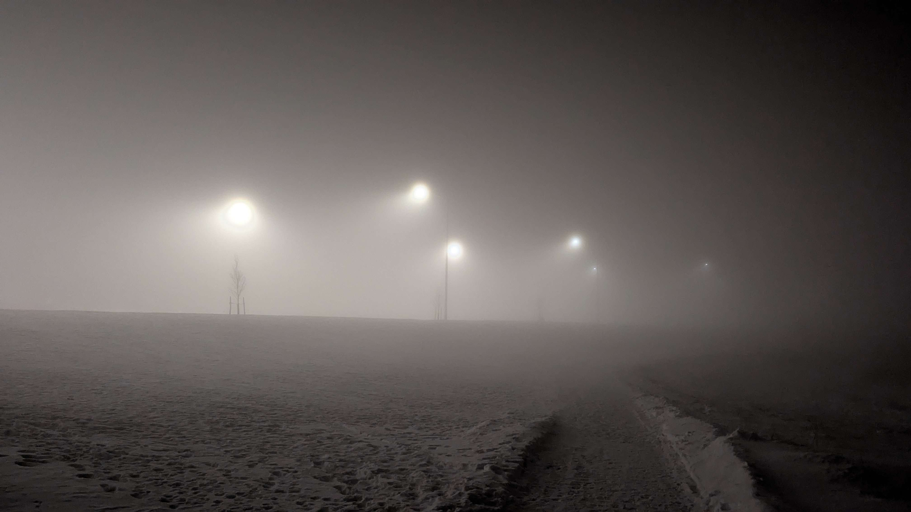

---

title: 'Weeknotes #15 - The fog comes for me'
pubDate: 2026-02-15
description: ''
author: 'Tal'
tags: ["Weeknotes"]
---

### Fun things this week 

- So sick for like half the week ;-;. The toilet was NOT happy to see me so many times.

- Got into messing with poetry some more! I've been really enjoying putting myself into different frames of thought as I work on these. Definately not confident in it yet to show to people but there is so much fun had.

- Worked out again for the first time in two weeks 💪. Turns out getting a tattoo into getting sick isn't good for you??? Who would've thought.

- Had a crazyyyy foggy night after I came back home one day. It was 2 AM and so damn hard to see outside, which in turn made my boring street feel so ethereal. Could barely see 20 meters ahead of me and took a bunch of photos and videos! Very good content for the MV I'm working on :3

### Music I've been listening to

- Ninajirachi every goddamn day baby. I Love My Computer is so damn good. Obsessing with Delete off the album recently.

### Other media 🎮📚🎬

- Being sick gave me a lot of time to play games!!! I played a shit ton of Pillars of Eternity 2! Had the game since it came out in 2018 but only started really playing it again through the last year. I've been adoring the exploration of colonization in the main story. None of the factions feel like the morally correct option, which is something the first game did well, but it is done even better in the sequel. I finally reached the first DLC, Beast of Winter. In truth I had tried it earlier, but wow that first fight to get into it is difficult. Eventually looked up online to see what startegies I was missing and found the beauty of Combusting Wounds. Stacking that on the dragon plus learning how to use interrupts made me breeze through the fight while learning a lot about how combat works! Rest of the DLC's combat was challenging but alas the systems of the game are known to me now :).

    That being said, what I care about most in the Beast of Winter is not the combat but the story! I initially made my character in the new run with the knowledge that I would explore this content eventually. Rymon is a Pale Elf born in the White that Wends to two parents devoted to the God of Decay, Rymengard. After the death of his wolf companion, he came to reject the notion of death and began practicing Animancy, become a Ghost Heart ranger! The focus on Rymengard in the Beast of Winter was just waiting for my character for a great roleplay experience! It's a fascinating premise that went in a completely different direction then expected. Rymon knowing of the Gods manufactured existence has even less love for Rymengard than prior to the events of the first game. And witnessing the god makes it very easy to dislike him, Rymengard is an absolute asshat. 

    Alongside the focus on Rymengard, other party members of the White that Wends finally get a chance to shine in the DLC. Vatnir, the sidekick introduced within its content, is an absolute treat. He's this non believer who ran away from home, only to lead the insane cult due to his birth as a Death aspected Godlike. He gets a unique priest subclass that makes him super fun to use! Ydwin is a sidekick from the main game that gets a bunch of dialogue here! It was a shame that she wasn't a full companion in the main, but she finally gets to shine here. Her gimmick of being so dedicated to animancy research that she became a vampire is incredibly funny to me, and her insight into the metaphysical aspects of the Beast of Winter are greatly appreciated.

    The greater lore implications within the realm of Rymengard teared me up a bit. The main plot of the DLC is essentially a undead dragon has tied its soul to an object within the realm of the dead, giving it the option to live forever and terrorize the cult of Rymengard on an island with a portal to aforementioned realm. Rymengard tasks the Watcher to kill it, else the ice of island will keep expanding as the gate within cannot be closed with the dragon walking among the living. The Watcher enters the realm where they are witness to a few points in Eora's history that souls may help in fighting the dragon. The three locations are Ukaizo before it was lost, the Godhammer killing Saint Waidwen, and an Engwithan trial. The Godhammer sequence in particular was the meat of the DLC to me. The event itself was the catalyst of the first games Hallowborn crisis. Waidwen was an almost mythical figure, having accrued an army across the continent while possessed by Eothas. Meeting the saint and understanding the person himself as opposed to the god controlling him humanized him in a way I never expected the games to go. Waidwen never believed in Eothas, as a child the young saint was abused into believing in the god of Dawn. Every harvest had to end in prayer, the saints hard work designated as a blessing and not something he achieved. When stricken with the chance to unite with Eothas, Waidewen connected with Eothas's goals, believing in that same world where destiny was a choice and not mandated by a manufactured higher power. Then getting more info about the Godhammer, and how Eothas knew and still let Waidwen walk into it, believing that it will change kith's relationship with the Gods. It's a beautifully tragic story that adds a lot of weight to an event that honestly I had forgotten about at this point. 

    That's my rant about Pillars 2!!! Excited to play more when I have time what a fantastic game.
    
- Watched the Moment and Requiem for a Dream this week. Both kind of alright. The Moment was fine, not offensive but not particularly great. Fun insight into how much of a nightmare being a popular artist with brand deals must be. Also Fantano showed up twice and I thought that was funny. Requiem for a Dream was compelling in the first half and then just felt like torture porn in the back half. Arnofsky is really not my type of director I fear.

🏶