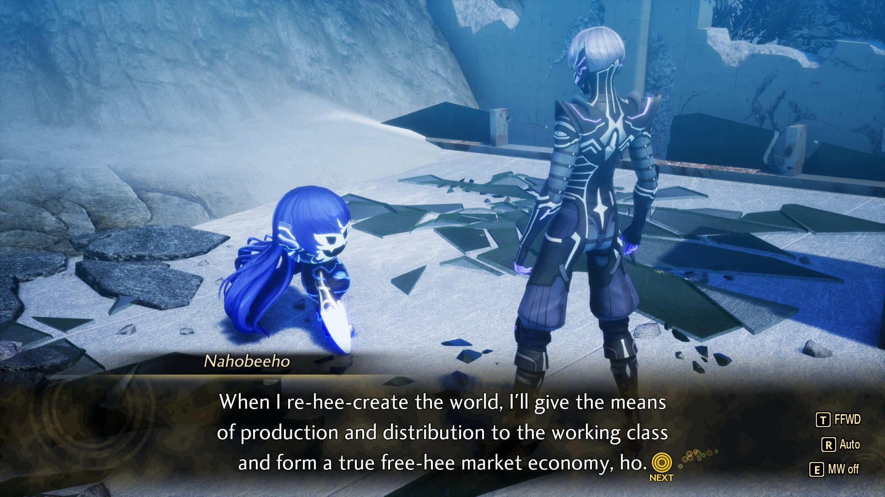

---

title: 'Weeknotes #28 - We are hee-homeboys!'
pubDate: 2026-06-08
description: 'I love Nahobeeho'
author: 'Tal'
tags: ["Weeknotes"]
---

Last few weeks have been,,, interesting. Nothing shows how loved and appreciated you are more than when you can't do much to begin with. Feel as if I say this constantly but to anyone who had reached out about my condition I greatly appreciate it!

### Fun things since last time

- Sat at home for much of the week after I got my leg messed up. First few days were rough but after a few days I was able to walk around a little bit! Lots of raised ice and raised foot cause man that guy was SWOLLEN. Doing much better now after a few appointments which involved my first ever ankle brace(!), and some physio. I will say getting ready to go out takes a little bit longer but I am ever so thankful to actually be able to walk :).

- Didn't go to run club because of my foot but I hung out with my buddies after they finished their runs! Beautiful weather outside in the morning, it was great just relaxing outside at the Forks. After we got breakfast and I was on my own I kept hanging outside, working on a secret page here and reading Dust of Dreams! Very nice to spend the day outside.

- After the wait I goofed around at the Pride festival in my city with my buds. Turns out MonsterTM is a queer icon and there was an option to get that tattooed on me at pride??? It was nice going to Pride on the day before the actual march, it's a much calmer environment comparatively to the next day. Also got to meet some cool new people!

- Somewhat of an ongoing thing but I have been going through my closet,,, turns out much of the clothes I've put off on wearing is actually very nice for layering. Now if only it stopped being so damn hot outside.

### Music I've been listening to

- Since a lot of my week off was spent playing this game,,, the soundtrack is absolutely stuck in my mind. Love the Quadistu battle theme a lot! That incomprehensible chanting in the background, the drums, and the piano all work so well!!! Very fun fights too.
<iframe width="400" height="315" src="https://www.youtube.com/embed/FPtJVXxZDRY?si=HMe0VU9vg1Kzktfs" title="YouTube video player" frameborder="0" allow="accelerometer; autoplay; clipboard-write; encrypted-media; gyroscope; picture-in-picture; web-share" referrerpolicy="strict-origin-when-cross-origin" allowfullscreen></iframe>

### Other media 🎮📚🎬

- Almost done with SMT:V!!! Up there for one of my favourite games ever at this point. The gameplay is sooo fun and snappy while still maintaining the right amount of difficulty. I finally met Nahobeeho, I am so in love. Jack Frost is maybe the best mascot in anything ever. There was no Jack Frost at my cities Pride festival,,, Kinda fucked up but here is my favourite quote from this lovable little shit.

- Finished Assassin's Quest. Still my fave of the Farseer trilogy. I did love the dynamic that the Fool and Fitz have later in the series finding its form within this book. Fitz and Nighteyes dynamic is still elite. While I did not like the trilogy as much as my first read almost 10 years ago, I will say it's still very enjoyable!

- Dust of Dreams keeps kicking ass. The Deck of Dragons reading absolutely nailed the otherworldly powers of it here. Everyone getting forced back by the cards thrown at them due to their unrestrained power within Letheras was sick. The rest of the Malazans in the city doing their own rituals to protect themselves during the reading but still failing set it up so damn well. The Errant freaking the fuck out as usual as always was a pleasure :). And love the dynamic Brys and Fiddler have! I have no idea what to make of the reading itself, but Quick Ben specifically started panicking over it. The tender moment at the end of the chapter with Fiddler thinkign about what he held back during the reading just shows the characters morals more than anything, still my favourite character in the series! Very excited to read more.

- I also played Mina the Hollower!!! Very very very unique game. It carries its inspirations on its sleeves while adding so much to the material. Based on 2d Zelda games, Bloodborne, and Castlevania, Mina mixes the aesthetic of the 3 so well its unreal. There's a level of difficulty that you don't see in zelda likes too often, alongside truly unique weapons that feel so fluid in the Game-Boy aesthetic the game encompasses itself in. Exploration is very knowledge based as opposed to item based. You can explore most of the map off the bat, but you may not have the knowledge from other areas to delve far into each of the games zones. There are so many secrets to find, so many hidden bosses, and an absolute boatload of custimization options for Mina in the form of trinkets. The music is as great as you would expect from the team fo Jake Kaufman and Yuzo Kushiro. Just such a great game with so much replayability :). I am having a blast with it!

### Quote of the week

> “oh WOW! hOw PrOfOUnD! how fUCkiN' iNspIriNg! PReTenTIoUS liTtLE diPshit!” 
>- Mothman, Shin Megami Tensei V: Vengeance

Holy fuck these demon haunt convos are so funny. Mothman specfically is insane and I cannot believe the above is a real line in a canon work of fiction in a 35+ year game universe. This rules so hard
🏶
