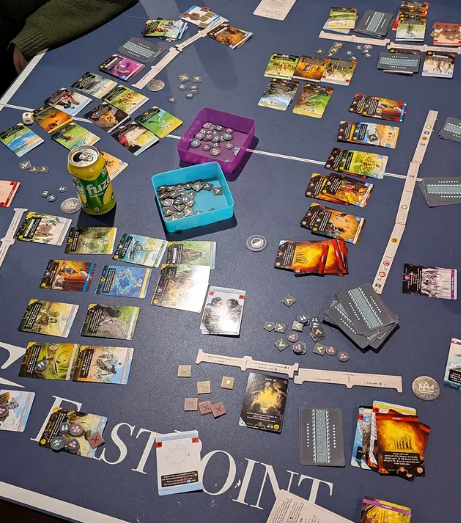

---

title: 'Weeknotes #8 - I love the eternal 7 day cycle'
pubDate: 2025-12-27
description: 'AMAZING GODLIKE WEEK'
author: 'Tal'
tags: ["Weeknotes"]
---

### Fun things this week 

- I met up with my friends that came in from across the country for the holidays!!!! I didn't realize how much I missed them we had so much fun messing around in the city

- Got me gifts for the holidays!! Got a microphone and a board game :). Said board game is very very fun and I'll be doing a post about it later.

- Went to a friends birthday party and caught up with some old buds! Twas nice seeing where they're at in life and the food was splendid!

- IMPERIUM HORIZON BABY WOOT! The new board game I got is so goddamn fun. It is addicting. I was so scared it would be a hard sell to people but my group was so willing to learn!
I felt so appreciated with that I love my friends so much ;-;. Especially after having a hard week recently, it was nice reconnecting with them all again this winter holiday.
There is a beautiful light in my life that only grows fuller. Also I got my ass whooped in the game so I hope they rot in hell :p

- Had an insane burger for my works holiday party. I love burger 🔥

### Music I've been listening to

- I treated myself to some records! There was a nice boxing week sale at a local record store so I got myself 'God Save the Animals' by Alex G and 'Ants From Up There' 
by Black Country New Road. Very fun records and a perfect tone setter for a chill board game night

### Other media 🎮📚🎬

- Utterly enthralled by 'Reapers Gale' still. I'm finally more than halfway done!

- Etrian Odyssey 2U's third stratum is getting me good. I got to a floor with a really difficulty sliding puzzle! The main issue was I marked my map wrong, and couldn't find 
a way to progress at a certain point. Had to treck through a whole floor again to figure out where I fucked up but it was still very fun :).

- Watched so many damn movies. Uncut Gems, Memories of Murder, Train to Busan, and Decision to Leave. My favourite of the week was Memories of Murder by far! Loved how one of the characters
just kept drop kicking suspects over and over again. Heartbreaking while at the same time one of the funniest movies I've seen in a while. Thing of note for me is the constant implications of
unrest in South Korea. While the horrors of the murders are ever present, we get small glimpses of the rest of Korea in riots. I want to look into what was going on in the country during said serial killings before
I rewatch the movie. An understanding of the countries situation at the time would only make this movie better in my eyes.

🏶