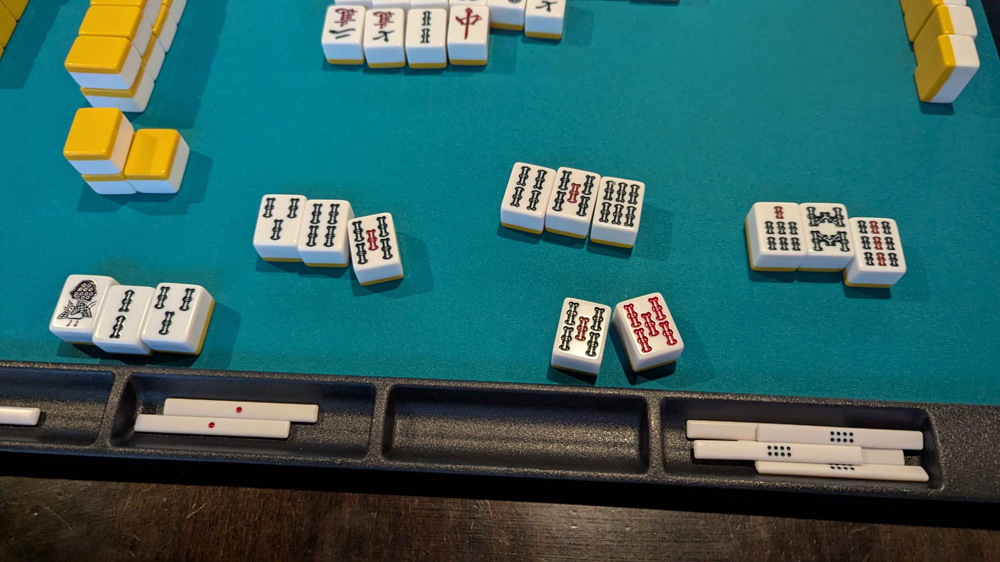

---

title: 'Weeknotes #9 - What the fuck is 7 days'
pubDate: 2025-12-27
description: 'Mixed week'
author: 'Tal'
tags: ["Weeknotes"]
---

### Fun things this week 

- Met up with some old work friends! Twas nice getting the group back together, and we did an escape room
at a place I've never heard of before. Really cool puzzles without as much of a adventure focus as other escape rooms in the city.
Definitely wanna go again in the future

- Had a potluck / hot pot session at a friends house! I made some spinach dip for the function to 
outstanding results >:). Other friends food was banging too!!! 

- WHOOPED ASS AT MAHJONG. Haven't played in a minute and I barely remembered how it worked but I got coerced into 
playing at the local this week. We ended up repeating East 3 like 4 times because the dealer kept winning ;-;. Eventually
made it into a few rounds of East 4, where I hit this absolutely insane hand. 
    
    _A beautiful straight bamboo flush_

    So to clarify exactly how much points this is worth, with the red 5 of bamboo, the straight, and the flush
    I got a 8 Han hand! So with that in mind and me not being dealer I got 16,000 points! In a standard Richii game players
    start with 30,000 points, and that one move this hand so far into the game was almost enough to eliminate
    one of the players >:3. Emphasis on one because I chii'd for the 9 of bamboo to rob the player in second at the table.
    Getting lucky has gotten me more pumped for mahjong than anything else ;-; can't wait to play again next week!

- Weirldy enough learned about synth soundboards and Japanese video game magazines in 1980.
Turns out the composer for Etrian Odyssey has a youtube channel where he talks about this stuff in fluent English???
Like man he is so damn cool I don't know how he does it. Turns out he even was somewhat of a pioneer for this stuff
programming a way to listen to fm tunes in the 80's??? And he still makes FM music for the love of the game.
Here's his channel!

    <iframe width="400" height="315" src="https://www.youtube.com/embed/tLqbixY5H0s?si=xo2EjK9wfOqqC-Xy" title="YouTube video player" frameborder="0" allow="accelerometer; autoplay; clipboard-write; encrypted-media; gyroscope; picture-in-picture; web-share" referrerpolicy="strict-origin-when-cross-origin" allowfullscreen></iframe>

### Music I've been listening to

- Once again I love Yuzo Koshiro. Been listening to my usual stuff but also to his cover of his own music
on his channel I just found out about!
    
    <iframe width="400" height="315" src="https://www.youtube.com/embed/D4FuOs4pvck?si=lDLeXD8BVRvynmor" title="YouTube video player" frameborder="0" allow="accelerometer; autoplay; clipboard-write; encrypted-media; gyroscope; picture-in-picture; web-share" referrerpolicy="strict-origin-when-cross-origin" allowfullscreen></iframe>
### Other media 🎮📚🎬

- Lots of thinking about Malazan still. Ended up checking out a few discussions online from a UofM prof
about the series! Avoided anything spoiler related but damn I love the passion people have for this series.
Super pumped up about the concept of Witnessed / Unwitnessed the series has brought to the forefront with 
Reapers Gale

- Yup yup Etrian Odyssey 2U. Honestly kind of dissappointed by the basement floors added in this remake. I'm
playing on Classic Mode so my criticism comes for that perspective. Ginnungagap (god I even don't like the name) falls flat in terms of
puzzle design. Music isn't anywhere as interesting as the rest of the game, the aesthetic is dull and colorless, and the monster encounters kind of suck??
It just feels off compared to the stratums from the original game, which I've been really enjoying!

- Watched Marty Supreme and Angel's Egg as a double feature! Honestly really dissappointed by Marty Supreme,
it fell very flat to me, especially in comparision to Uncut Gems. The soundtrack and visuals were great, but the
character work felt off. Marty wasn't a compelling protagonist to me, and the shennangins and defemation he
got himself into felt like a long gag that wasn't funny to me. There was also a lack of an emotional core for me, 
I had a hard time finding any characters to care for, and even the rivalry Marty had with the Japanese player felt weak.
Though I do have to give praises to the ping pong matches themselves. The Safdies are very good at creating tension for 
competitions. Angel's Egg was a banger!
🏶