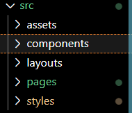

For someone who tends to struggle with getting used to new frameworks, Astro was a blessing.
I had always told myself, I'd make my own website on one of these web frameworks. 

One day.

There was this urge to do it, but never enough of a desire to get started, especially on other
frameworks I've used in the past, such as Laravel or Next.js. __Especially__ Next.js.
But that's a topic for another time. 

Two things motivated me to start and finish this website. The first being my buddy encouraging me to with their
[beautiful website](https://lovepill.moe/). The second being the tutorial for the framework they used.
[Astro's tutorial](https://docs.astro.build/en/tutorial/0-introduction/) does exactly what I would want a tutorial to do for a website. It's quick, to the point, and 
finishes up with a cool product that is extremely easy to add upon using the documentation. Having that urge to add more to the tutorial as I was 
making my way through it, told me I had to finish a website this time. And I did!

With the background info out of the way lets get to the nitty gritty of the website!

Above is how I organized my files. 'Pages' is where all my blog posts and website pages are, 'layouts' naturally has the layouts I use, which is currently
only two layouts for regular pages and blog pages,  and components and styles are any repeat offenders in this website :). 

I use MDX for blog posts, which as someone who hasn't ever touched markdown before this website, did take me a bit to adjust too. 
MDX in Astro allows for use of Astro's own features within it, which I ended up using in the `<Image />` component Astro provides.
`<Image />` optimizes your image ratios, inferring height and width based on components around the image itself. With my love for images 
in posts, and a lack of image tools in regular markdown, I just had to switch on over to MDX. Something I particurly enjoyed when I transitioned over
from markdown to MDX, is that you can still use basic markdown image syntax with the added image optimization! Little was changed to make use of the 
benefits!

The last topic I want to discuss in this website for now is the CSS. I've always loved software development more. CSS is hard.
But I got something decent looking! It took a while, and a looooot of brainstorming and scouting of other personal websites to find a style I liked.
I also did not initially understand how styling worked in Astro, so I would try to change the styles of components outside of them as a per basis instance.
I eventually realized that it is impossible to style a specific html tag inside a component outside of it, unless its within the use of a CSS sheet.

#### Future Plans

While the website is fine as it is now, I would love to add more flavour to it. On my search for ideas, I found plenty that stood out to me.
Being a person who's obssessed with media, the idea of a media page where I can add quick reviews sounds great to me.
I want to add spotify integration, so people on the site can see the last song I've listened to. The website needs more color, and I want to see how I can
go about adding that in a way that fits with the tone I want.